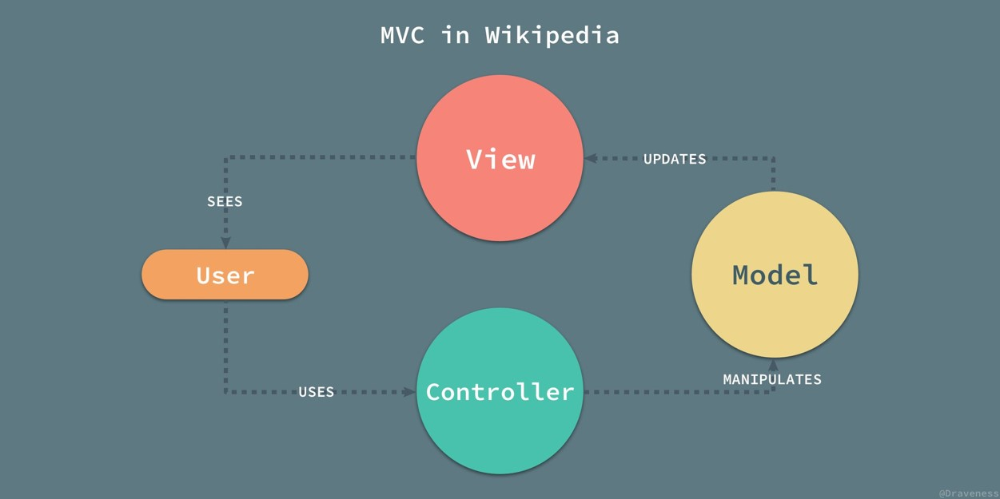

# 数据库设计与应用开发大作业实验报告

## 小组成员

 - 张金亮
 - 远笛     
 - 洪梓聪   15344015

## 实验简介

### 开发目的

对于本次数据库设计与应用开发，我们小组决定开发一个ToDoList类型基于安卓平台的软件，然后在开发中对数据的存储应用ORM型数据库，并结合老师上课所教的知识，顺便还可以锻炼小组开发合作能力，该软件未来还可以给我们规划学习和生活提供便利。

### 想法来源

市场上的ToDoList软件都是比较简单的设定目标，完成之后就直接把这个目标删除，这样并没有给用户完成任务后的快感，所以我们希望开发一个新的App，可以记录之前完成的所有任务，并支持查询之前的任务，还能显示出完成情况和每天的进步状况，这就需要有数据库的支持，但是因为我们这是一个在Android平台的App，如果数据库太繁琐太大的话，可能会使App占用过多空间，而且我们是个三人小团队，只有一个星期的开发周期，我们只能挑选一些比较简单的数据库来加速开发。

## 实验环境

- JDK 1.8.0
- Android 4.4+
- Android Studio 3.1
- greenDAO 3.2.2
- Junit 4.12
- Butterknife 8.5.1

## 实验原理

### GreenDAO数据库

Android中提供了一个占用内存极小的关系型数据库SQLite和许多操作SQLite的API，但我们仍需要手动去编写许多SQL语句来操作数据库，这大大的增加了思维的复杂度，由于我们小组人员较少和开发时间较短，所以我们决定采用「greenDAO」—— 一个SQLite数据库的Android ORM，来进行软件数据库建设。

### ButterKnife

### Android

### MVC

本实验在Android平台上利用MVC架构，并使用Butterknife加速开发，Junit测试设计出一款便于学生进行日常时间管理的软件。在数据库方面，我们采用了greenDAO来将Model中的EverydayTask（每日任务）和OnedayTask（当日任务）两个对象映射成数据库中的表，并且添加增删改查的操作行为，同时利用greenDAO中内置的优化方法去提升数据库的速度，而我们不用传统数据库的原因是因为我们团队较小，时间比较紧急，利用ORM型数据库可以有效的缩短开发时间，降低开发难度。

## 数据库设计

在SaltedFish

1. EverydayTask

2. OnedayTask

## 实验结果

## 实验反思与改进

## 参考文献