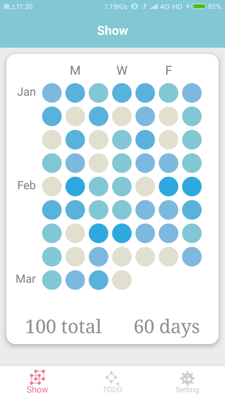
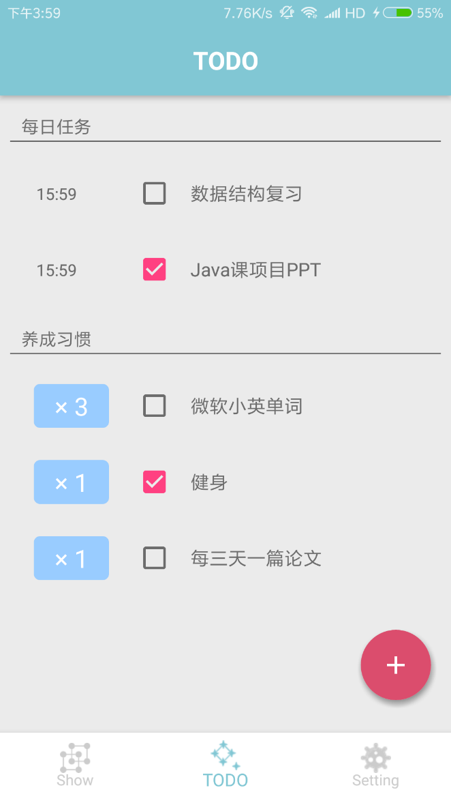
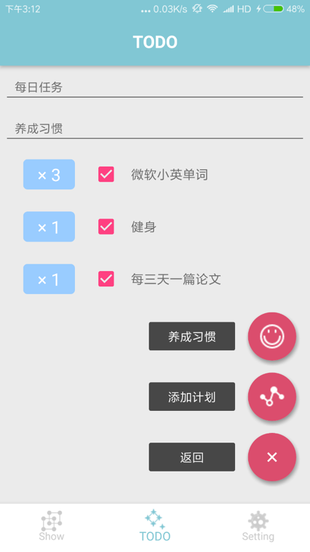
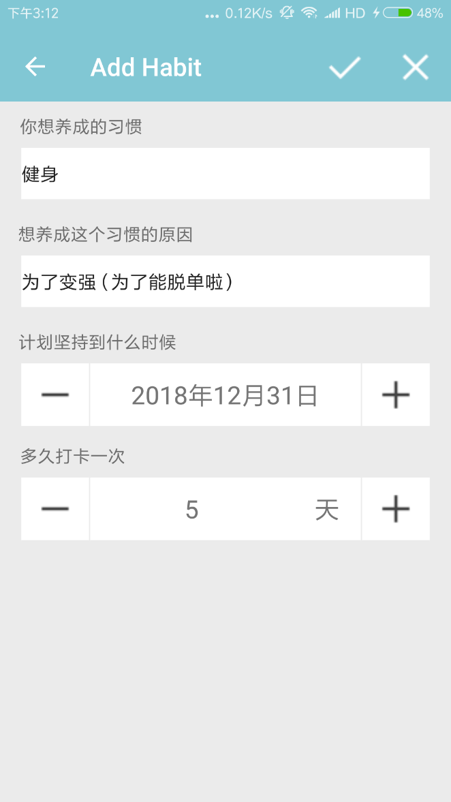
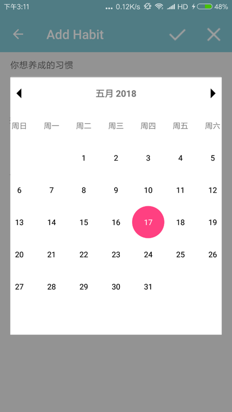

# 数据库设计与应用开发大作业实验报告

#### 小组成员
|姓名|学号|工作量|
|---|---|---|
 |  张金亮  |  16340288  |  33%
 |  周远笛  |  16340311  |  33%
 |  洪梓聪  |  15344015  |  33%

## 实验简介

### 开发目的

对于本次数据库设计与应用开发，我们小组决定开发一个ToDoList类型基于安卓平台的软件。在开发中对数据的存储应用ORM型数据库，并结合课程所学对数据库的关系以及属性进行设计。此次实验中不仅锻炼了小组开发合作能力，还制作出了未来可以给我们规划学习和生活提供便利的软件。

### 想法来源

市场上的ToDoList软件都是比较简单的设定目标，完成之后就直接把这个目标删除，这样并没有给用户完成任务后的快感，所以我们希望开发一个新的App，可以记录之前完成的所有任务，并支持查询之前的任务，还能显示出完成情况和每天的进步状况。

相比于其他同类竞品，我们这个设计的主要优势在于使用多种成功学、心理学上的驱动方式（包括成就感驱动、“一步之遥”驱动、初衷驱动等等）让人坚持不懈地努力。

## 实验环境

- JDK 1.8.0

- Android 4.4+

- Android Studio 3.1

- greenDAO 3.2.2

  > Android中提供了一个占用内存极小的关系型数据库SQLite和许多操作SQLite的API，但我们仍需要手动去编写许多SQL语句来操作数据库，这大大的增加了思维的复杂度，由于我们小组人员较少和开发时间较短，所以我们决定采用「greenDAO」—— 一个SQLite数据库的Android ORM，来进行软件数据库建设。
  >
  > 
  >
  > 选择greenDAO数据库是考虑到其易用性以及轻量级的特性，由于其占用很小的内存但却有不俗的表现，对于我们三人的小开发团队是个不错的选择。
  >
  > 

- Junit 4.12

  > Junit是一个Java平台的单元测试框架，对于软件开发的测试阶段非常重要，可以结合xml一起使用。

- Butterknife 8.5.1

  > ButterKnife 是一个注入框架，专门为 Android View 设计的绑定注解，可以省去很多要写的东西，加速开发。 

## 实验原理

本实验在Android平台上利用MVC架构，并使用Butterknife加速开发，Junit测试设计出一款便于学生进行日常时间管理的软件。在数据库方面，我们采用了greenDAO来将Model中的EverydayTask（每日任务）和OnedayTask（当日任务）两个对象映射成数据库中的表，并且添加增删改查的操作行为，同时利用greenDAO中内置的优化方法去提升数据库的速度，而我们不用传统数据库的原因是因为我们团队较小，时间比较紧急，利用ORM型数据库可以有效的缩短开发时间，降低开发难度。

## 数据库设计

### 部署环境

1. Gradle配置

```gradle
// root build.gradle file
dependencies {
        classpath 'com.android.tools.build:gradle:3.0.1'
        classpath 'org.greenrobot:greendao-gradle-plugin:3.2.2'
}
```

2. 设置greenDAO中schema的版本

```gradle
// build.gradle file of your app project
greendao {
    schemaVersion 1
    daoPackage 'com.ping.greendao.gen'
    targetGenDir 'src/main/java'
}
```

### 生成

1. 实体类 EverydayTask

在习惯部分，需要先创建数据表，设置表的名字为EVERY_DAY_TASK，其属性有

   - id - 唯一标记事件
   - name - 习惯的名称
   - detail - 时间细节
   - mEndTime - 事件结束时间
   - isComplete - 事件结束与否

```java
import org.greenrobot.greendao.annotation.Entity;
import org.greenrobot.greendao.annotation.Id;

import java.util.Calendar;
import org.greenrobot.greendao.annotation.Generated;

//用来记录习惯的object
@Entity
public class EveryDayTask extends Task{

    @Id(autoincrement = true)
    private Long id;
    private String detail;
    private long mEndTime;
    private boolean isComplete;
    private String name;

    //是否需要每天定时提醒
    private boolean isDetailTime=false;

    private int combos=0;

    @Generated(hash = 1296861129)
    public EveryDayTask(Long id, String detail, long mEndTime, boolean isComplete,
            String name, boolean isDetailTime, int combos) {
        this.id = id;
        this.detail = detail;
        this.mEndTime = mEndTime;
        this.isComplete = isComplete;
        this.name = name;
        this.isDetailTime = isDetailTime;
        this.combos = combos;
    }

    @Generated(hash = 1597007745)
    public EveryDayTask() {}

    public boolean getIsSomeDay(){
        return false;
    }

    public Long getId() {
        return this.id;
    }

    public String getDetail() {
        return this.detail;
    }

    public void setDetail(String detail) {
        this.detail = detail;
    }

    public boolean getIsComplete() {
        return this.isComplete;
    }

    public void setIsComplete(boolean isComplete) {
        this.isComplete = isComplete;
    }

    public String getName() {
        return this.name;
    }

    public void setName(String name) {
        this.name = name;
    }

    public boolean getIsDetailTime() {
        return this.isDetailTime;
    }

    public void setIsDetailTime(boolean isDetailTime) {
        this.isDetailTime = isDetailTime;
    }

    public int getCombos() {
        return this.combos;
    }

    public void setCombos(int combos) {
        this.combos = combos;
    }

    public long getMEndTime() {
        return this.mEndTime;
    }

    public void setMEndTime(long mEndTime) {
        this.mEndTime = mEndTime;
    }

    public void setId(Long id) {
        this.id = id;
    }

    public Calendar getEndTime(){
        Calendar calendar=Calendar.getInstance();
        calendar.setTimeInMillis(mEndTime);
        return calendar;
    }

}
```

注射方法的解析：
 - @Entity：将普通类变为一个能够被greenDAO识别的数据库类型的实体类
 - @Id：选择一个long / Long属性作为实体ID，在数据库方面，它是主键，而参数autoincrement是用来设置Id值自增
 - 接着通过AndroidStudio的MakeProject，可以自动生成getter和setter的方法，如上面的代码所示


2. OnedayTask

在每日任务部分，需要先创建数据表，设置表的名字为ONE_DAY_TASK，其属性有

   - id - 唯一标记事件
   - name - 习惯的名称
   - detail - 时间细节
   - mEndTime - 事件结束时间
   - isComplete - 事件结束与否
   - isDetailTime - 是否需要精确时间

```java
import org.greenrobot.greendao.annotation.Entity;
import org.greenrobot.greendao.annotation.Id;

import java.text.SimpleDateFormat;
import java.util.Calendar;
import java.util.Date;

import org.greenrobot.greendao.annotation.Generated;

//用来记录每日任务详情的object
@Entity
public class OneDayTask extends Task{

    @Id(autoincrement = true)
    private Long id;
    private String detail;
    private long mEndTime;
    private boolean isComplete;
    private String name;
    private boolean isDetailTime=false;

    @Generated(hash = 1512230442)
    public OneDayTask(Long id, String detail, long mEndTime, boolean isComplete,
                      String name, boolean isDetailTime) {
        this.id = id;
        this.detail = detail;
        this.mEndTime = mEndTime;
        this.isComplete = isComplete;
        this.name = name;
        this.isDetailTime = isDetailTime;
    }

    @Generated(hash = 1382090838)
    public OneDayTask() {
    }

    public Calendar getEndTime(){
        Calendar calendar=Calendar.getInstance();
        calendar.setTimeInMillis(mEndTime);
        return calendar;
    }

    public Long getId() {
        return this.id;
    }


    public void setId(Long id) {
        this.id = id;
    }


    public String getDetail() {
        return this.detail;
    }


    public void setDetail(String detail) {
        this.detail = detail;
    }


    public boolean getIsComplete() {
        return this.isComplete;
    }


    public void setIsComplete(boolean isComplete) {
        this.isComplete = isComplete;
    }


    public String getName() {
        return this.name;
    }


    public void setName(String name) {
        this.name = name;
    }


    public boolean getIsDetailTime() {
        return this.isDetailTime;
    }


    public void setIsDetailTime(boolean isDetailTime) {
        this.isDetailTime = isDetailTime;
    }

    public long getMEndTime() {
        return this.mEndTime;
    }

    public void setMEndTime(long mEndTime) {
        this.mEndTime = mEndTime;
    }

}
```

### 管理

1. 编写DaoManager，用于创建数据库、创建数据库表、包含增删改查的操作以及数据库的升级

```java
import android.content.Context;

import com.ping.greendao.gen.DaoMaster;
import com.ping.greendao.gen.DaoSession;

import org.greenrobot.greendao.query.QueryBuilder;

public class DBManager {

    private static final String TAG = DBManager.class.getSimpleName();
    private static final String DB_NAME = "saltedFishDB";

    private Context context;

    //多线程中要被共享的使用volatile关键字修饰
    private volatile static DBManager manager = new DBManager();
    private static DaoMaster sDaoMaster;
    private static DaoMaster.DevOpenHelper sHelper;
    private static DaoSession sDaoSession;

    /**
     * 单例模式获得操作数据库对象
     * @return
     */
    public static DBManager getInstance(){
        return manager;
    }

    public void init(Context context){
        this.context = context;
    }

    /**
     * 判断是否有存在数据库，如果没有则创建
     * 应用了单例模式
     * @return
     */
    public DaoMaster getDaoMaster(){
        if(sDaoMaster == null) {
            //创建新的数据库
            DaoMaster.DevOpenHelper helper = new DaoMaster.DevOpenHelper(context, DB_NAME, null);
            sDaoMaster = new DaoMaster(helper.getWritableDatabase());
        }
        return sDaoMaster;
    }

    /**
     * 完成对数据库的添加、删除、修改、查询操作，仅仅是一个接口
     * @return
     */
    public DaoSession getDaoSession(){
        if(sDaoSession == null){
            if(sDaoMaster == null){
                sDaoMaster = getDaoMaster();
            }
            sDaoSession = sDaoMaster.newSession();
        }
        return sDaoSession;
    }

    /**
     * 关闭所有的操作，数据库开启后，使用完毕要关闭
     */
    public void closeConnection(){
        closeHelper();
        closeDaoSession();
    }

    public void closeHelper(){
        if(sHelper != null){
            sHelper.close();
            sHelper = null;
        }
    }

    public void closeDaoSession(){
        if(sDaoSession != null){
            sDaoSession.clear();
            sDaoSession = null;
        }
    }

}
```

2. 编写EveryDayDaoUtil和OneDayDaoUtil类，用于完成对某一张数据表的具体操作。

```java
import android.content.Context;
import android.util.Log;

import com.ping.greendao.gen.EveryDayTaskDao;

import org.greenrobot.greendao.query.QueryBuilder;

import java.util.List;

import hongzicong.saltedfish.db.DBManager;
import hongzicong.saltedfish.model.EveryDayTask;

public class EveryDayDaoUtil {

    private static final String TAG = EveryDayDaoUtil.class.getSimpleName();
    private DBManager mManager;

    public EveryDayDaoUtil(Context context){
        mManager = DBManager.getInstance();
        mManager.init(context);
    }

    /**
     * 完成插入，如果表未创建，先创建表
     * @param everyDayTask
     * @return
     */
    public boolean insertEveryDayTask(EveryDayTask everyDayTask){
        boolean flag = false;
        flag = mManager.getDaoSession().getEveryDayTaskDao().insert(everyDayTask) == -1 ? false : true;
        Log.i(TAG, "insert Meizi :" + flag + "-->" + everyDayTask.toString());
        return flag;
    }

    /**
     * 插入多条数据，在子线程操作
     * @param everyDayTaskList
     * @return
     */
    public boolean insertMultEveryDayTask(final List<EveryDayTask> everyDayTaskList) {
        boolean flag = false;
        try {
            mManager.getDaoSession().runInTx(new Runnable() {
                @Override
                public void run() {
                    for (EveryDayTask everyDayTask : everyDayTaskList) {
                        mManager.getDaoSession().insertOrReplace(everyDayTask);
                    }
                }
            });
            flag = true;
        } catch (Exception e) {
            e.printStackTrace();
        }
        return flag;
    }

    /**
     * 修改一条数据
     * @param everyDayTask
     * @return
     */
    public boolean updateEveryDayTask(EveryDayTask everyDayTask){
        boolean flag = false;
        try {
            mManager.getDaoSession().update(everyDayTask);
            flag = true;
        }catch (Exception e){
            e.printStackTrace();
        }
        return flag;
    }

    /**
     * 删除单条记录
     * @param everyDayTask
     * @return
     */
    public boolean deleteEveryDayTask(EveryDayTask everyDayTask){
        boolean flag = false;
        try {
            //按照id删除
            mManager.getDaoSession().delete(everyDayTask);
            flag = true;
        }catch (Exception e){
            e.printStackTrace();
        }
        return flag;
    }

    /**
     * 删除所有记录
     * @return
     */
    public boolean deleteAll(){
        boolean flag = false;
        try {
            //按照id删除
            mManager.getDaoSession().deleteAll(EveryDayTask.class);
            flag = true;
        }catch (Exception e){
            e.printStackTrace();
        }
        return flag;
    }

    /**
     * 查询所有记录
     * @return
     */
    public List<EveryDayTask> queryAllEveryDayTask(){
        return mManager.getDaoSession().loadAll(EveryDayTask.class);
    }

    /**
     * 根据主键id查询记录
     * @param key
     * @return
     */
    public EveryDayTask queryEveryDayTaskById(long key){
        return mManager.getDaoSession().load(EveryDayTask.class, key);
    }

    /**
     * 使用native sql进行查询操作
     */
    public List<EveryDayTask> queryEveryDayByNativeSql(String sql, String[] conditions){
        return mManager.getDaoSession().queryRaw(EveryDayTask.class, sql, conditions);
    }

    /**
     * 使用queryBuilder进行查询
     * @return
     */
    public List<EveryDayTask> queryEveryDayByQueryBuilder(long id){
        QueryBuilder<EveryDayTask> queryBuilder = mManager.getDaoSession().queryBuilder(EveryDayTask.class);
        return queryBuilder.where(EveryDayTaskDao.Properties.Id.eq(id)).list();
    }

}
```


```java
import android.content.Context;
import android.util.Log;

import com.ping.greendao.gen.EveryDayTaskDao;
import com.ping.greendao.gen.OneDayTaskDao;

import org.greenrobot.greendao.query.QueryBuilder;

import java.util.List;

import hongzicong.saltedfish.db.DBManager;
import hongzicong.saltedfish.model.EveryDayTask;
import hongzicong.saltedfish.model.OneDayTask;

public class OneDayDaoUtil {

    private static final String TAG = OneDayDaoUtil.class.getSimpleName();
    private DBManager mManager;

    public OneDayDaoUtil(Context context){
        mManager = DBManager.getInstance();
        mManager.init(context);
    }

    /**
     * 完成插入，如果表未创建，先创建表
     * @param oneDayTask
     * @return
     */
    public boolean insertOneDayTask(OneDayTask oneDayTask){
        boolean flag = false;
        flag = mManager.getDaoSession().getOneDayTaskDao().insert(oneDayTask) == -1 ? false : true;
        Log.i(TAG, "insert OneDayTask :" + flag + "-->" + oneDayTask.toString());
        return flag;
    }

    /**
     * 插入多条数据，在子线程操作
     * @param oneDayTaskList
     * @return
     */
    public boolean insertMultOneDayTask(final List<OneDayTask> oneDayTaskList) {
        boolean flag = false;
        try {
            mManager.getDaoSession().runInTx(new Runnable() {
                @Override
                public void run() {
                    for (OneDayTask oneDayTask : oneDayTaskList) {
                        mManager.getDaoSession().insertOrReplace(oneDayTask);
                    }
                }
            });
            flag = true;
        } catch (Exception e) {
            e.printStackTrace();
        }
        return flag;
    }

    /**
     * 修改一条数据
     * @param oneDayTask
     * @return
     */
    public boolean updateOneDayTask(OneDayTask oneDayTask){
        boolean flag = false;
        try {
            mManager.getDaoSession().update(oneDayTask);
            flag = true;
        }catch (Exception e){
            e.printStackTrace();
        }
        return flag;
    }

    /**
     * 删除单条记录
     * @param oneDayTask
     * @return
     */
    public boolean deleteOneDayTask(OneDayTask oneDayTask){
        boolean flag = false;
        try {
            //按照id删除
            mManager.getDaoSession().delete(oneDayTask);
            flag = true;
        }catch (Exception e){
            e.printStackTrace();
        }
        return flag;
    }

    /**
     * 删除所有记录
     * @return
     */
    public boolean deleteAll(){
        boolean flag = false;
        try {
            //按照id删除
            mManager.getDaoSession().deleteAll(OneDayTask.class);
            flag = true;
        }catch (Exception e){
            e.printStackTrace();
        }
        return flag;
    }

    /**
     * 查询所有记录
     * @return
     */
    public List<OneDayTask> queryAllOneDayTask(){
        return mManager.getDaoSession().loadAll(OneDayTask.class);
    }

    /**
     * 根据主键id查询记录
     * @param key
     * @return
     */
    public OneDayTask queryOneDayTaskById(long key){
        return mManager.getDaoSession().load(OneDayTask.class, key);
    }

    /**
     * 使用native sql进行查询操作
     */
    public List<OneDayTask> queryOneDayByNativeSql(String sql, String[] conditions){
        return mManager.getDaoSession().queryRaw(OneDayTask.class, sql, conditions);
    }

    /**
     * 使用queryBuilder进行查询
     * @return
     */
    public List<OneDayTask> queryOneDayTaskByQueryBuilder(long id){
        QueryBuilder<OneDayTask> queryBuilder = mManager.getDaoSession().queryBuilder(OneDayTask.class);
        return queryBuilder.where(OneDayTaskDao.Properties.Id.eq(id)).list();
    }

}
```

### 使用

1. 插入一个OneDayTask进入数据库中

```java
\\ in AddTaskAdapter.java
public long addInToDB(){
    OneDayTask oneDayTask=getTaskFromViewHolder();
    oneDayDaoUtil.insertOneDayTask(oneDayTask);
    return oneDayTask.getId();
}
```

2. 插入一个EveryDayTask进入数据库中

```java
\\ in AddHabitAdapter.java
public long addInToDB(){
    EveryDayTask everyDayTask=getTaskFromViewHolder();
    everyDayDaoUtil.insertEveryDayTask(everyDayTask);
    return everyDayTask.getId();
}
```

## 实验结果

### 代码

附件SaltedFish所示，代码量约为6000行

### 界面功能介绍

1. 下面这个界面是我们设计的核心部分，如软件设计的灵感来源所述，完成事情之后带来的成就感是驱动之后继续坚持习惯/打卡的源动力之一，而下图中的界面即为成果的展示。（可以参考Github中commit次数统计图）

<div align=center>



</div>

2. 下图这个界面是基本的TodoList，我们自定义了一个TableView，并建立一些接口，可以让开发者改变颜色、形状等，未来计划将其单独抽出来，写成一个开源的Android组件，每日任务部分只是做了一个比较简单的TodoList，完成即打勾的形式。但下半部分的习惯养成是本app的亮点之一，前面的数字为连续多少天完成任务，每天看到坚持了更加多天数可以让人在坚持打卡之余更有前进的动力，也更会有成就感，有点像背单词的打卡系统，拥有记录连续打卡天数的功能。

<div align=center>



</div>


3. 红色的加号图标使用了开源组件FloatingActionMenu，我们用它加多了三个功能，分别是添加习惯、添加每日任务和返回，由于内置了好看的动画，并且接口也很易用，所以我们采用它来在Todo页面提供了快捷方便的添加各种事项的功能。

<div align=center>



</div>


4. 对于“养成习惯”的事件，我们添加了“想养成这个习惯的原因”一栏，目的是让人“不忘初心、善始善终”。

<div align=center>



</div>


5. 日期选择界面，我们使用了material design风格的Android日历

<div align=center>



</div>

## 参考文献